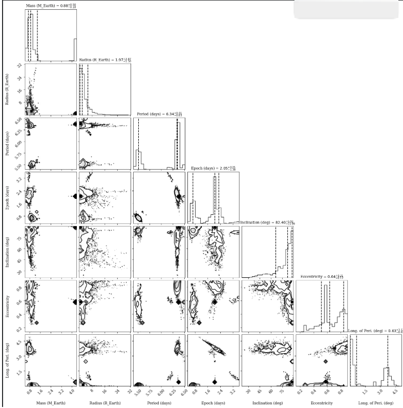

cat << 'EOF' > README.md

  
  

  <h1>🌌 Intro to Astro: Exoplanet Detection & Deep Learning 🌌</h1>
  
  **Astro-Portfolio of Kemal Sadık Demirbaş | Software Architect & Data Scientist**
  
  

    
    
    
    
    
  

  
  <i>Welcome to my central repository for the international astronomy and data science program. This space serves as my continuous academic logbook, hosting rigorous programming assignments, astrophysical calculations, data science notebooks, and pipeline deployment benchmarks.</i>
  

 

## 🌌 Program Overview
* **Role:** Student / Software Architect
* **Core Focus:** Planetary formation models, exoplanet detection, and deep learning integrations in astrophysics.
* **Timeline:** July 2026 onwards.

---

## 📁 Repository Roadmap & Structure

### 🟩 Week 1: Linux Unix & Version Control Systems
* **Terminal Practice (`foo_dir/`):** Core hands-on session mastering file operations (`mkdir`, `nano`, `cp`, `mv`).
  * 🖥️ **[View Terminal Operations Screenshot](./week1/assignment1_terminal_practice.png)**
* **Git Fundamentals:** Establishing local time machines, committing configurations, and managing deployment branches.
  * 🚀 **[View Git Deployment Screenshot](./week1/assignment4_git_practice.png)**
* **Literature Survey:** Annotated analysis on exoplanet radius valley paper utilizing deep learning methods.
  * 📄 **[Read My Annotated Research Paper (PDF)](./week1/annotated_astro_paper.pdf)**
  * **Deep Learning Optimization:** Integrating deep neural networks to pre-compute structure models dramatically optimizes calculation time.
  * **Core Mass Dichotomy:** Pebble isolation mass increases at longer orbital periods, explaining why icy cores systematically grow larger than rocky ones.
  * **Radius Valley Breakthrough:** While pure photoevaporation models leave gaps, integrating early-stage giant impacts yields structure distributions that mirror stellar flux properties perfectly.

### 🟧 Week 2: Python Programming & Exoplanet Detection
* **Data Pipelines & Analytics:** Engineered robust Python data streams using `numpy` and `matplotlib` to extract, clean, and process high-cadence time-series transit data from space missions like TESS.
* **Transit Photometry Modeling:** Implemented the `batman` package to execute analytical light curve fittings, constraining precise planet-to-star radius ratios ($R_p/R_*$), semi-major axes ($a/R_*$), and orbital inclinations ($inc$).
* **Radial Velocity Analytics:** Modeled stellar reflex motions and velocity semi-amplitudes ($K$) via Keplerian orbit solvers (Newton-Raphson iteration for Eccentric Anomaly) to isolate distinct physical vectors and resolve mass-inclination degeneracies.
* **MCMC Parameter Optimization:** Deployed the `emcee` (Ensemble Sampler) Markov Chain Monte Carlo algorithm to map multi-dimensional parameter spaces, generating tight joint posterior probability distributions.
* **Planetary Interior Inference:** Evaluated mass-radius dimensions against core theoretical equations of state, classifying the targeted object as a volatile-rich, water-dominated sub-Neptune or liquid ocean world.
  * 📂 **[View Notebook: Exoplanet Detection Methods](./week2/Intro2Astro_Exoplanet_Detection_Methods%20(1).ipynb)**
  * 📂 **[View Notebook: Python & Jupyter Tutorial](./week2/Python_Tutorial.ipynb)**
* 📄 **Literature Survey:** Deep dive into the exoplanet detection review paper by Lee (2018)[cite: 1, 2].
  * 📥 **[Read/Download the Original Review Paper (PDF)](./week2/Lee_2018_Exoplanets_Review.pdf)**[cite: 1]
  * 📝 **[Read My Analytical Discussion & Questions (PDF)](./week2/Literature%20Review%20Questions%20-%20Lee%202018.pdf)**[cite: 2]

---

### 📷 Week 1 Execution Proofs
Here is a direct preview of the accomplished terminal environment tasks:

---

### 📷 Week 2 Diagnostic Preview
The definitive multi-dimensional joint and marginal posterior probability distributions showcasing structural parameter correlations derived via the MCMC `emcee` sampler:

  

---

***Maintained with 🖥️ by Kemal Sadık Demirbaş.***
EOF
